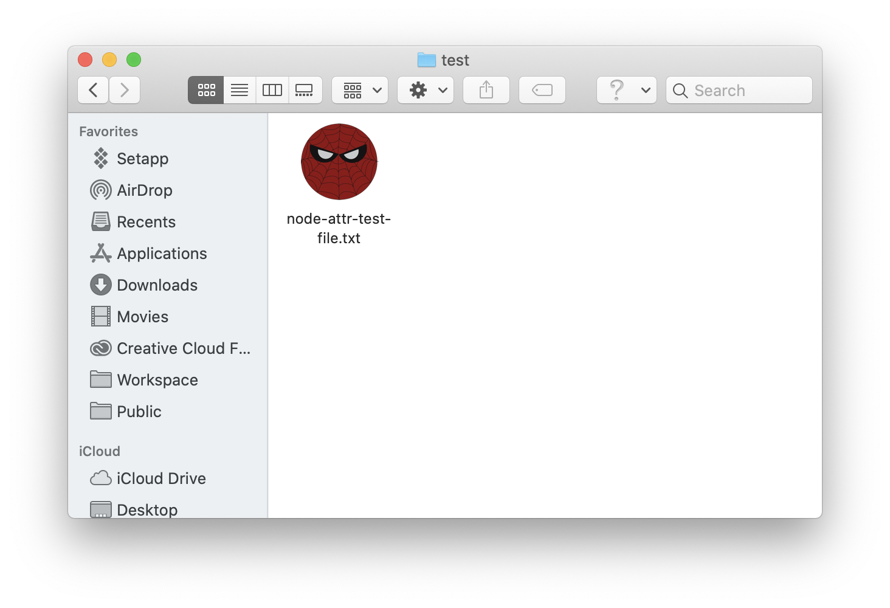

[](https://badge.fury.io/js/node-xattr)

# node-xattr

A library to manipulate xattr on macOS with Typescript support.
APIs provided by this library are similar to node's fs module.

- [**Requirements**](#requirements)
- [**Installation**](#installation)
- [**When to use the sync version**](#when-to-use-the-sync-version)
- [**Get xattr**](#get-xattr)
- [**Set xattr**](#set-xattr)
- [**List xattr**](#list-xattr)
- [**Remove xattr**](#remove-xattr)
- [**Set Custom Icon For File**](#set-custom-icon)
- [**Parse FileMeta**](#parse-filemeta)

# What's xattr

> Extended attributes are arbitrary metadata stored with a file, but separate from the filesystem attributes (such as modification time or file size). The metadata is often a null-terminated UTF-8 string, but can also be arbitrary binary data.

Xattr is a mechanism provided by the system.
With xattr, you can store your own data as attributes to file. Also, you can pass data to Finder or other apps.

For example, you can set custom icon for a file:



You can add a `com.apple.quarantine` xattr to make the system check the origin of the file you downloaded:


Or you can remove this xattr on an existing file, and this window will not display.

# Requirements

Runtime

- Node.js v10+ (Electron with Node.js 10+ works)

Development

- macOS 10.14+ with XCode

# Installation

```sh
$ yarn add node-xattr
```

# When to use the sync version

Technically, the sync version would be a little faster. Because the async version waits for a queue to schedule.
Also, The sync verion is realtime, it would be an advantage in some scenarios.
The disadvantage of the sync version is that it will probably block the process. So DO NOT use sync version in 
some UI process(such as the renderer process of Electron).
The best scenario to use sync version is in background worker/process/thread.

# Set xattr

```
setXattrSync(path: string, name: string, value: string | Buffer): void;

setXattr(path: string, name: string, value: string | Buffer): Promise<void>;
```

Sync
```js
const { setXattrSync } = require('node-xattr');
setXattrSync('./test.txt', 'key', 'value');
```

Async
```js
const { setXattr } = require('node-xattr');

setXattr('./test.txt', 'key', 'value').catch(err => console.error(err));
```

# Get xattr

```
getXattrSync(path: string, name: string): Buffer;

getXattrSync(path: string, name: string, encoding: string): string;

getXattr(path: string, name: string): Promise<Buffer>;

getXattr(path: string, name: string, encoding: string): Promise<string>;
```

Sync
```js
const { getXattrSync } = require('node-xattr');
const buffer = getXattrSync('./test.txt', 'key');
const string = getXattrSync('./test.txt', 'key', 'utf8');
```


Async
```js
const { getXattr } = require('node-xattr');

getXattr('./test.txt', 'key', function (err, buffer) {
  if (err) {
    console.error(err);
    return;
  }
  console.log(buffer);
});

getXattr('./test.txt', 'key').then(buffer => console.log(buffer)).catch(err => console.error(err));

getXattr('./test.txt', 'key', 'utf8').then(str => console.log(str)).catch(err => console.error(err));
```

# List xattr

```
listXattrSync(path: string): string[];

listXattr(path: string): Promise<string[]>;
```

Sync
```js
const { listXattrSync } = require('node-xattr');

const list = listXattrSync('./test.txt');
```

Async
```js
const { listXattr } = require('node-xattr');

listXattr('./test.txt').then(list => console.log(list)).catch(err => console.error(err));
```

# Remove xattr

```
removeXattrSync(path: string, name: string): void;

removeXattr(path: string, name: string): Promise<void>;
```

Sync
```js
const { removeXattrSync } = require('node-xattr');
removeXattrSync('./test.txt', 'key');
```

Async
```js
const { removeXattr } = require('node-xattr');
removeXattr('./test.txt', 'key').catch(err => console.error(err));
```

# Set Custom Icon

`setCustomIcon` are in `macUtils` namespace:

```
setCustomIcon(filePath: string, iconPath: string): Promise<void>;
setCustomIconSync(filePath: string, iconPath: string): void;
```

Sync
```js
const { macUtils } = require('node-xattr');

macUtils.setCustomIconSync(TestFile, iconPath);
```

Async
```js
const { macUtils } = require('node-xattr');
macUtils.setCustomIcon(TestFile, iconPath).catch(err => console.log(err));
```

# Parse FileMeta

This library provide utils to parse some content written by system:

```
serializeArrayOfString(content: string[]): Buffer;
deserializeArrayOfString(buffer: Buffer): string[];
```

You can use above functions in `macUtils` to parse `com.apple.metadata:kMDItemWhereFroms`.
